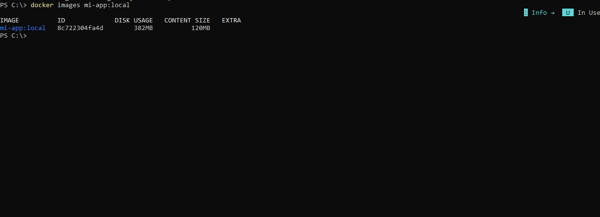
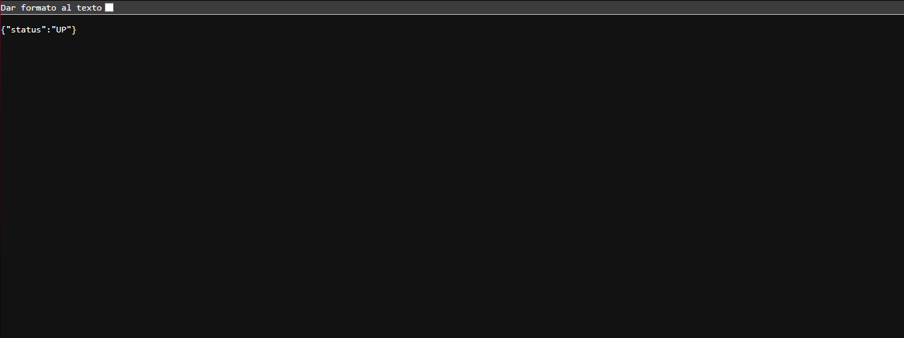
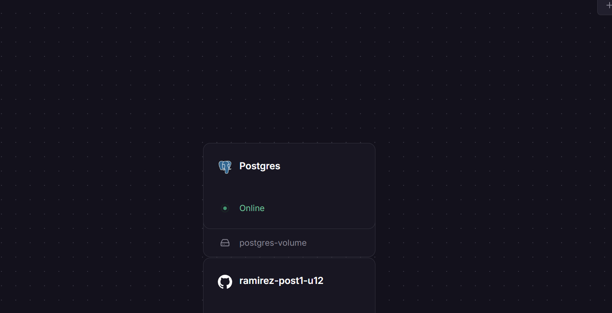
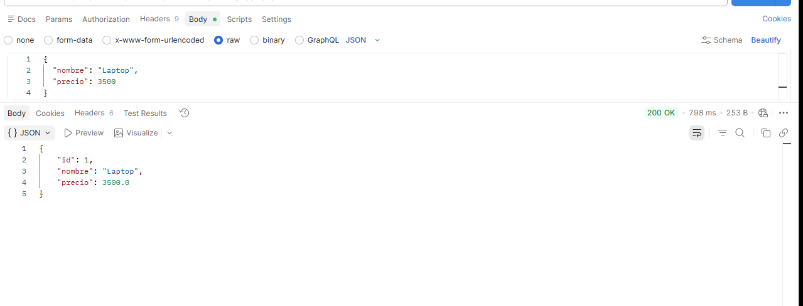
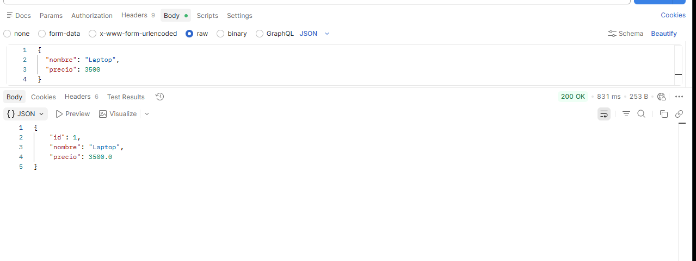

## Contenedorizar Spring Boot y desplegar en Railway

## Autor

- Nombre: Kevin Javier Ramirez
- Programa: Ingenieria de Sistemas
- Asignatura: Programacion Web
- Unidad: 12 - Despliegue y CI/CD
- Actividad: Post-Contenido 1
- Proyecto: ramirez-post1-u12

## Objetivo

API REST de catalogo de productos contenedorizada con Docker multi-stage,
perfil de produccion por variables de entorno, PostgreSQL local con Docker
Compose y preparacion para despliegue en Railway.

## Tecnologias

- Java 21
- Spring Boot 3.2.5
- Maven Wrapper
- Spring Web
- Spring Data JPA
- Spring Boot Actuator
- PostgreSQL 16
- Flyway
- Docker y Docker Compose

## Endpoints REST

| Metodo | Ruta | Descripcion |
| --- | --- | --- |
| GET | `/actuator/health` | Healthcheck de la aplicacion |
| GET | `/api/productos` | Lista productos activos |
| GET | `/api/productos/{id}` | Busca un producto por id |
| POST | `/api/productos` | Crea un producto |
| DELETE | `/api/productos/{id}` | Elimina un producto por id |

## Variables de entorno de produccion

| Variable | Descripcion | Ejemplo local |
| --- | --- | --- |
| `SPRING_PROFILES_ACTIVE` | Activa el perfil productivo | `prod` |
| `DATABASE_URL` | URL JDBC de PostgreSQL | `jdbc:postgresql://db:5432/appdb` |
| `DB_USER` | Usuario de PostgreSQL | `appuser` |
| `DB_PASS` | Contrasena de PostgreSQL | `apppass` |

## Construccion Docker local

```powershell
docker build -t mi-app:local .
docker images mi-app:local
```

La imagen usa dos etapas:

1. `eclipse-temurin:21-jdk-alpine` para compilar con Maven Wrapper.
2. `eclipse-temurin:21-jre-alpine` para ejecutar solo el JAR con usuario no root.

## Ejecucion con Docker Compose

```powershell
docker compose up -d --build
docker compose ps
curl.exe http://localhost:8080/actuator/health
```

Crear un producto:

```powershell
curl.exe -i -X POST http://localhost:8081/api/productos `
  -H "Content-Type: application/json" `
  -d "{\"nombre\":\"Laptop\",\"precio\":3500000,\"categoria\":\"ELECTRONICA\"}"
```

Consultar endpoints:

```powershell
curl.exe -i http://localhost:8081/api/productos
curl.exe -i http://localhost:8081/api/productos/1
curl.exe -i -X DELETE http://localhost:8081/api/productos/1
```

Detener el stack:

```powershell
docker compose down
```

## Despliegue en Railway

1. Entrar a `https://railway.app` con GitHub.
2. Crear un proyecto con `Deploy from GitHub repo`.
3. Seleccionar el repositorio `ramirez-post1-u12`.
4. Confirmar que Railway detecta el `Dockerfile`.
5. Agregar una base de datos: `+ New` -> `Database` -> `Add PostgreSQL`.
6. En el servicio de la aplicacion, abrir `Variables` y crear:

```text
SPRING_PROFILES_ACTIVE=prod
DATABASE_URL=${{Postgres.DATABASE_URL}}
DB_USER=${{Postgres.PGUSER}}
DB_PASS=${{Postgres.PGPASSWORD}}
```

7. En `Settings` -> `Networking`, seleccionar `Generate Domain`.
8. Probar la URL publica:

```powershell
curl.exe https://kevinjavierramirez55.up.railway.app/actuator/health
curl.exe -i -X POST https://kevinjavierramirez55.up.railway.app/api/productos -H "Content-Type: application/json" -d "{\"nombre\":\"Laptop\",\"precio\":3500000,\"categoria\":\"ELECTRONICA\"}"
curl.exe -i https://kevinjavierramirez55.up.railway.app/api/productos
curl.exe -i https://kevinjavierramirez55.up.railway.app/api/productos/1
```

## Checkpoints y capturas sugeridas

### Checkpoint 1 - Dockerfile multi-stage

Capturar:

- `Dockerfile` abierto mostrando `AS builder`, `21-jdk-alpine`, `21-jre-alpine`, `USER spring` y `ENTRYPOINT`.
- `.dockerignore` mostrando `target/` y `.git/`.
- Terminal con:

```powershell
docker build -t mi-app:local .
docker images mi-app:local
```

### Checkpoint 2 - Docker Compose y PostgreSQL local

Capturar:

- Terminal con:

```powershell
docker compose up -d --build
docker compose ps
curl.exe http://localhost:8080/actuator/health
```

- Respuesta de al menos un endpoint REST:

```powershell
curl.exe -i -X POST http://localhost:8080/api/productos -H "Content-Type: application/json" -d "{\"nombre\":\"Laptop\",\"precio\":3500000,\"categoria\":\"ELECTRONICA\"}"
curl.exe -i http://localhost:8080/api/productos
```

### Checkpoint 3 - Railway

Capturar:

- Panel de Railway con el servicio de la aplicacion desplegado.
- Servicio PostgreSQL creado en Railway.
- Variables configuradas en Railway sin mostrar valores secretos completos.
- Dominio publico generado.
- Terminal o navegador con:

```powershell
curl.exe https://kevinjavierramirez55.up.railway.app/actuator/health
curl.exe -i -X POST https://kevinjavierramirez55.up.railway.app/api/productos -H "Content-Type: application/json" -d "{\"nombre\":\"Mouse\",\"precio\":85000,\"categoria\":\"ACCESORIOS\"}"
curl.exe -i https://kevinjavierramirez55.up.railway.app/api/productos
curl.exe -i https://kevinjavierramirez55.up.railway.app/api/productos/1
```

## Repositorio

```text
https://github.com/kevinjavierramirez55-tech/ramirez-post1-u12
```

---

## Capturas del Proyecto

Las capturas se encuentran en la carpeta `evidencias/`.

### Imagen docker



### Railway app



### Panel de railway




### Endpoint crear producto



### Endpoint obtener producto por id


